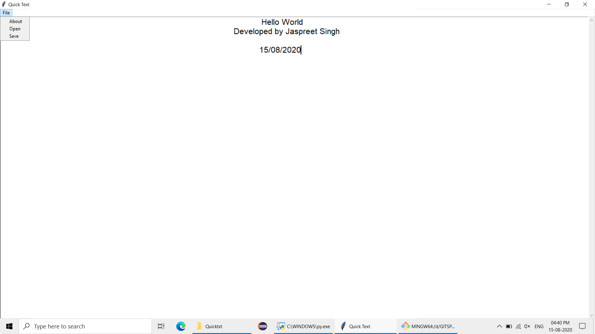

# QuickTXT
Notepad like python application with features like save and open the files. Supports file such as .txt , .py , .c , .c++ , .cbp , .js , .html , .java and many more.

## Getting Started

1.Fork this project into your github repo 
2.Clone project into local computer 
3.Use python or its prerequisite libraries to run 
4.Enjoy.

### Prerequisites
1.Python 
2.Tkinter library 
3.os library

## Screenshots

* Working screen

## Built With

* Pycharm
* Love

## Language implementation
* Python
## Libraries used
1. Thinter
2. os

## Version
v1.0

## Want to contribution ?
We welcome everyone to contribute on this project
### To contribute
1. Fork this project
2. Clone onto your local computer
3. debug code or add features or anything you want to add
4. Send the pull request

## Authors

Jaspreet Singh

## Lets connect
LinkedIn -https://www.linkedin.com/in/jaspreetsidhu13/
 
GitHub -https://github.com/jaspreetsidhu3
